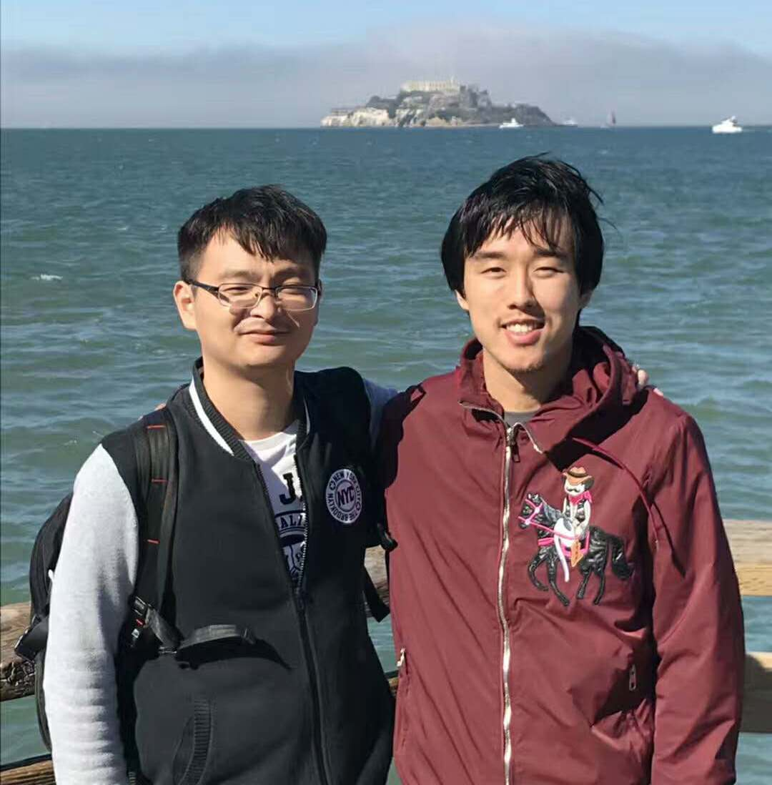
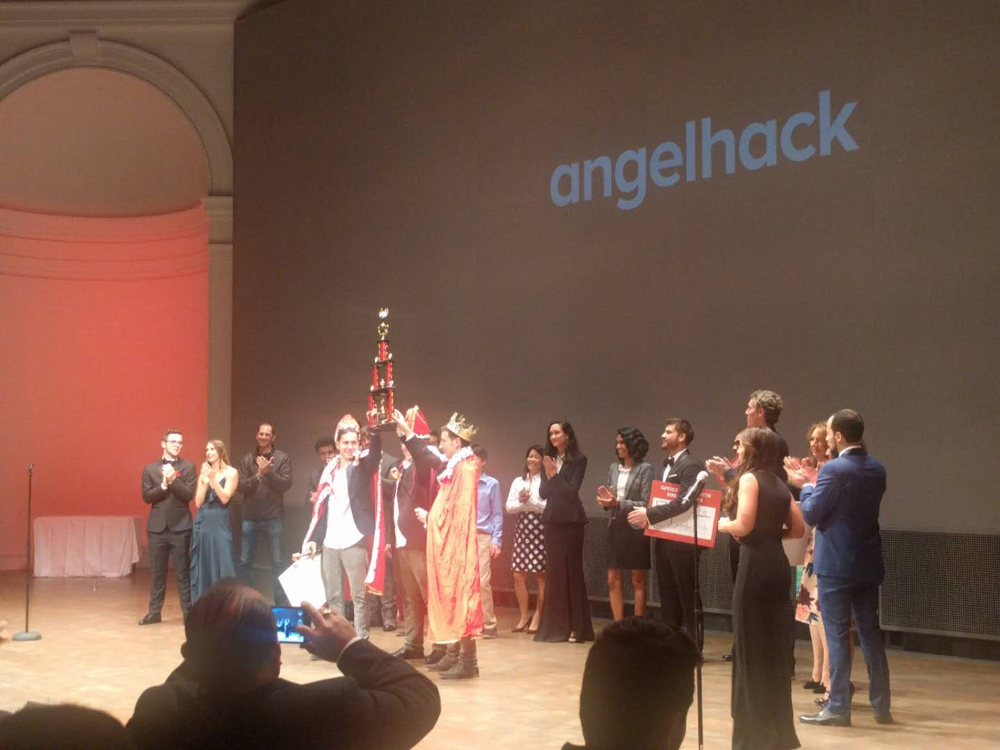
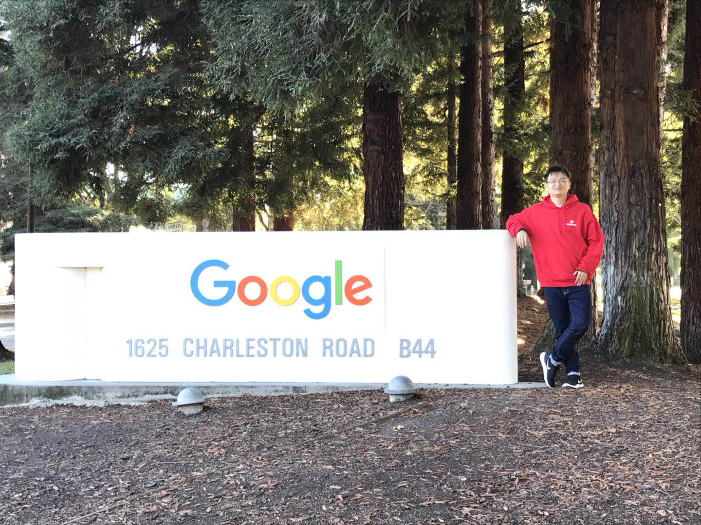
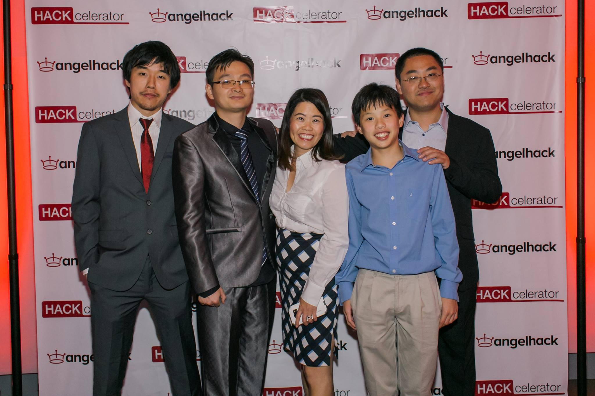

## My Journey With AngelHack

## My Experience
* 2009 graduated from university, work in Beijing as technical support engineer
* 2013 come to Shenzhen, start doing software development, mainly in IoT industry
* 2016 first hackathon

## What does hackathon mean to me
* To work on ideas I came up with but had no time to do in daily work
* Get feedbacks from experts and fellow coders

## How I came up with the idea of TeamUp

## HACKcelerator
* Video conference with guest speakers
* Deliverables
* Check-in calls with mentor

  ## What I learned
  * Minimum Viable Product
  * Feedback loop and data

  ## Gauntlet Call - Silicon Valley or Not
  

## Silicon Valley

  ## Silicon Valley Week Schedule
  * Mon. ~ Wed. pitch training at a co-working space
  * Thu. Global Demo Day and after party at Wilsey Center for Opera
  * Sat. picnic at Dolores Park and saying goodbye

