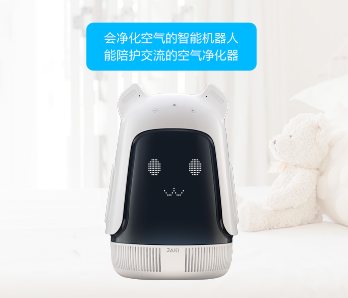
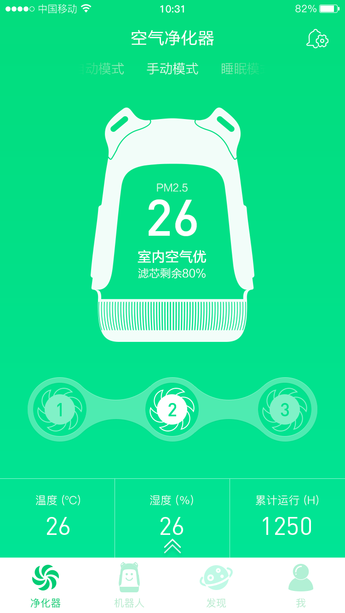
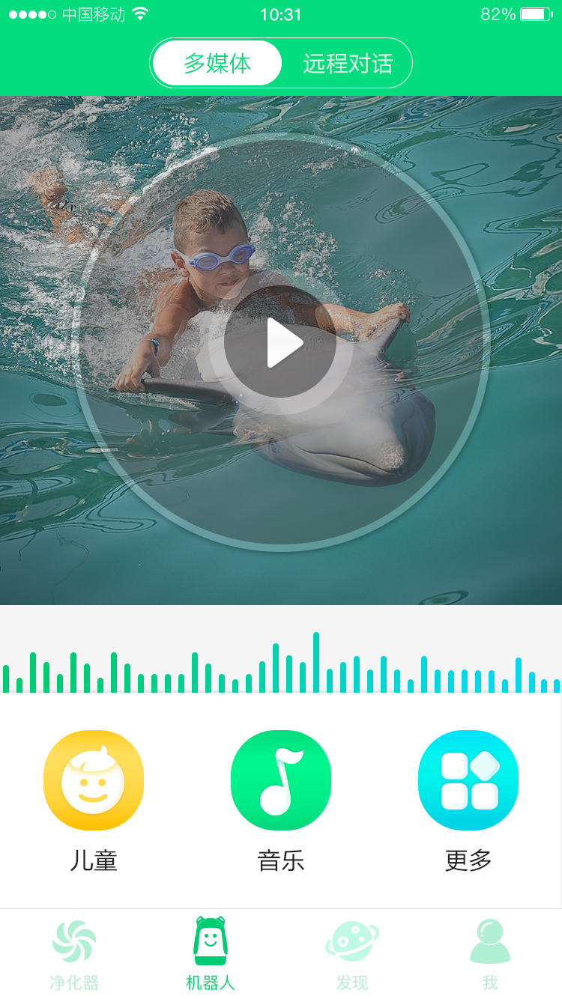
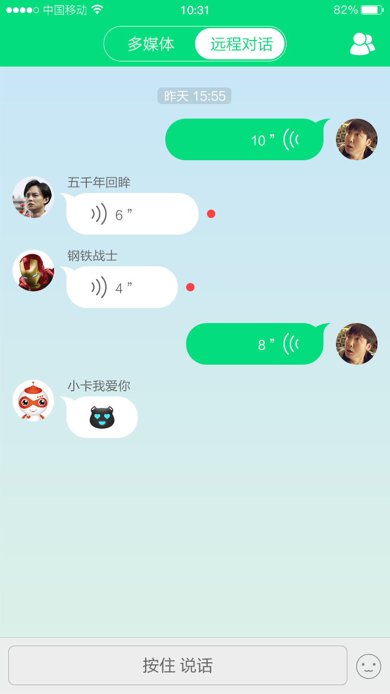

# 智能机器人空气净化器

## 产品简介
这是一款智能机器人产品，集儿童陪伴和空气净化功能于一身，除了通过语音和机身上的开关进行交互，还能通过手机APP完成丰富的控制功能，包括：搜索添加设备、设置净化器工作模式、查看实时和历史运行状态、创建日程提醒、浏览并播放故事、儿歌，远程语音聊天等。
我司帮助客户设计了APP UI，并开发和上架了iOS版APP。
## APP界面
* 空气净化器

* 多媒体播放

* 远程语音聊天

## 更多信息
* [产品网站](http://www.jiaqi789.com/index.php?m=content&c=index&a=show&catid=27&id=87)
* [App Store](https://itunes.apple.com/cn/app/佳佳机器人/id1250366985?l=zh&ls=1&mt=8)
