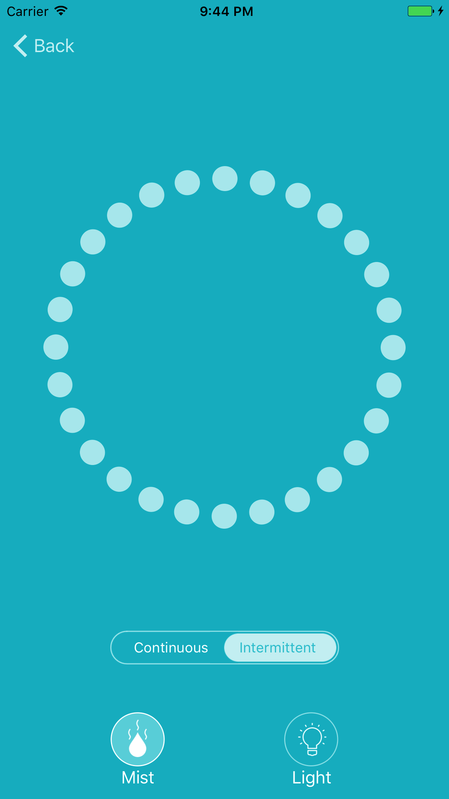
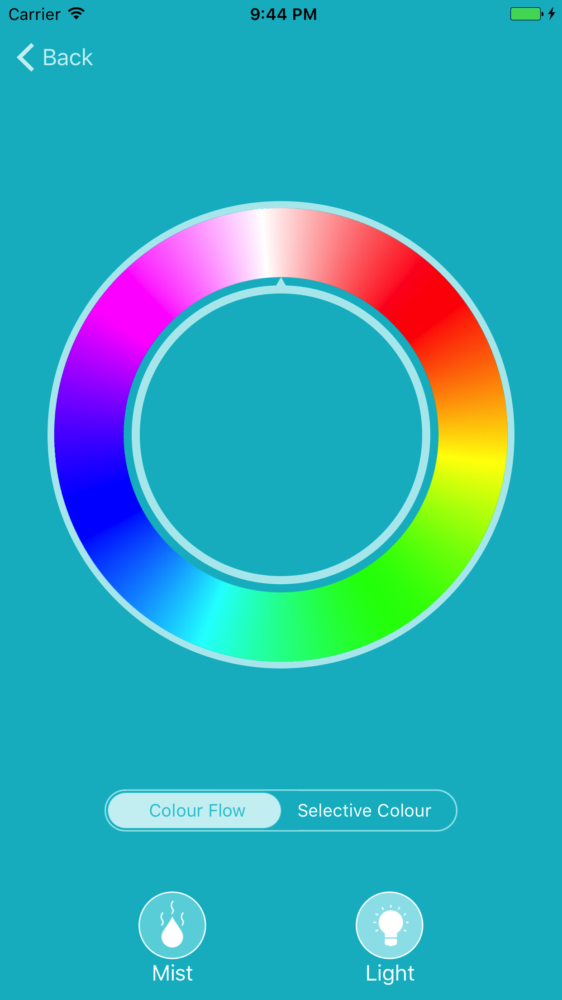

# 蓝牙香薰机
## 产品简介
香薰机是一种小型家电，使用时加少量的水并滴上精油，机器通过超声波将水打成雾状缓缓喷出，起到加湿空气、芳香疗愈的作用，同时配合机身上的LED灯营造安静、温馨的气氛。普通的香薰机通过机身上的按钮控制，近年来有厂家根据客户的要求，推出了支持手机控制的产品，APP通过蓝牙连接到机器，发送指令设置和读取机器的工作状态。我司帮助厂家完成了Android、iOS APP的设计和开发，并上架到iOS App Store和Google Play。
## APP界面
* 搜索添加设备

* 控制喷雾

* 控制灯光

## 更多信息
* [App Store](https://itunes.apple.com/cn/app/madebyzen-oska-aroma-diffuser/id1188964652?l=zh&ls=1&mt=8)
* [Google Play](https://play.google.com/store/apps/details?id=net.erabbit.aromadiffuser.oska)