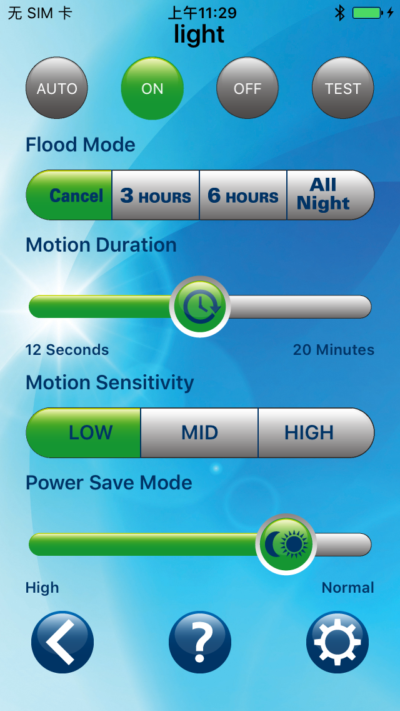

# 蓝牙感应灯
## 产品简介
感应灯
用于庭院
通过环境亮度检测和运动感应自动控制灯光的开启和关闭
用APP设置灯具的工作模式、亮度、灵敏度、延时时间等
UI由客户提供，我司负责iOS和Android APP的开发
采用了Xamarin.Forms跨平台开发技术，通过一套代码分别编译出适用于Android和iOS平台的原生工程，有效确保了在不同平台上功能和用户体验的一致性，缩短了开发时间。APP最终通过了美国客户的严格验收，上架到App Store和Google Play。
## APP界面
* 启动画面

* 设备列表

* 设备控制

## 更多信息
* [客户产品介绍](http://www.cooperindustries.com/content/public/en/lighting/products/floodlighting/_891085.html)
* [App Store](https://itunes.apple.com/US/app/id1231612281?mt=8)
* [Google Play](https://play.google.com/store/apps/details?id=net.erabbit.eaton)
