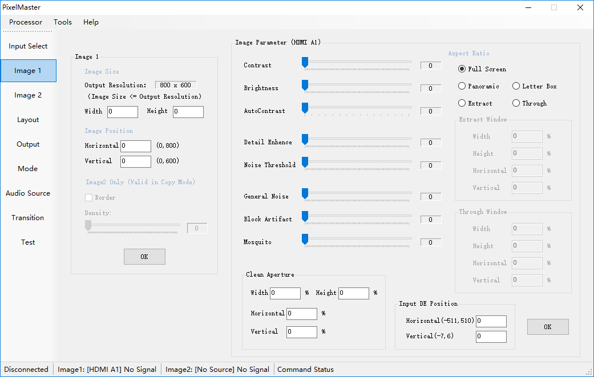
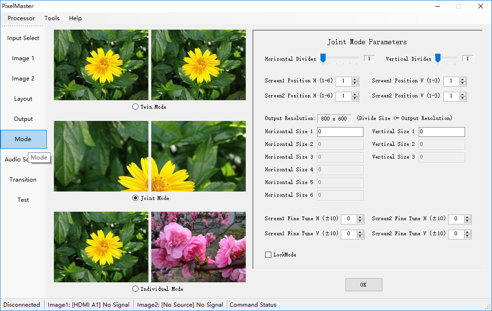
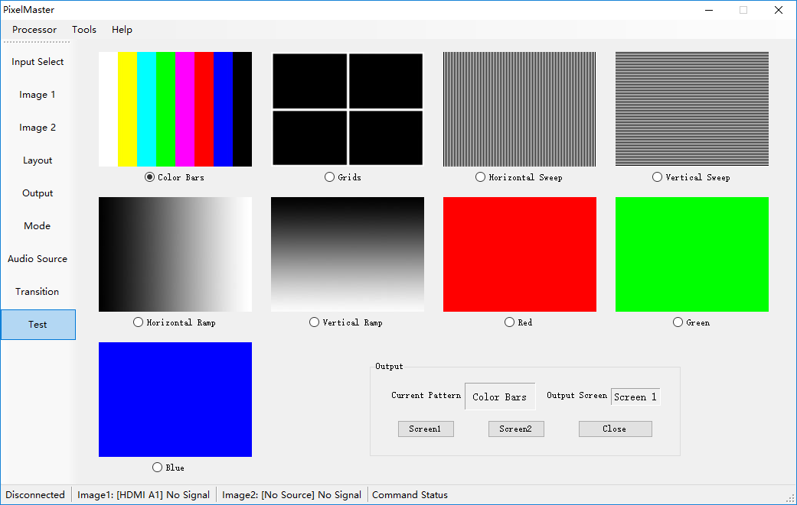

# 视频处理系统上位机软件
## 产品简介
这是一套用于舞台演出等场景的视频处理系统，可以实现输入信号选择、画面调整（亮度、对比度、长宽比例等）、多屏拼接、添加切换特效等多种功能。需要通过上位机软件与设备通信，读取和设置大量复杂的工作参数。
我司为客户设计上位机软件，此项目的难点在于理解需求细节，选择合适的控件类型准确、直观地展示各种选项，最终我们顺利完成了任务。
## APP界面
* 画面调整  

* 工作模式  

* 测试信号  

