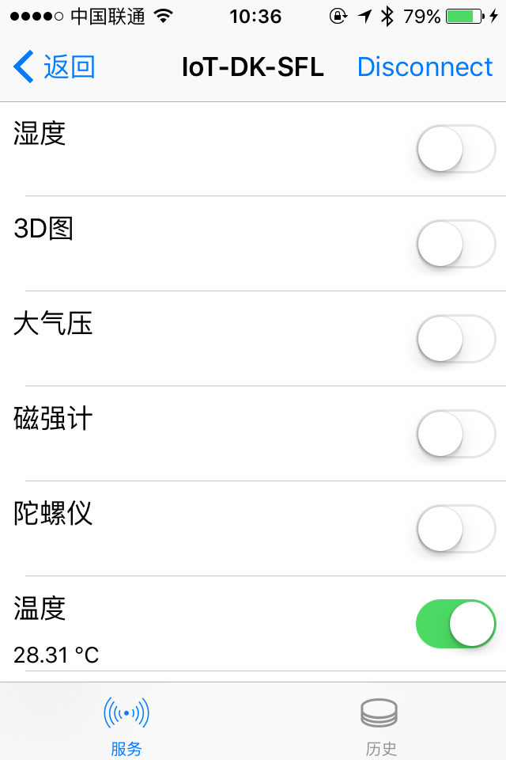
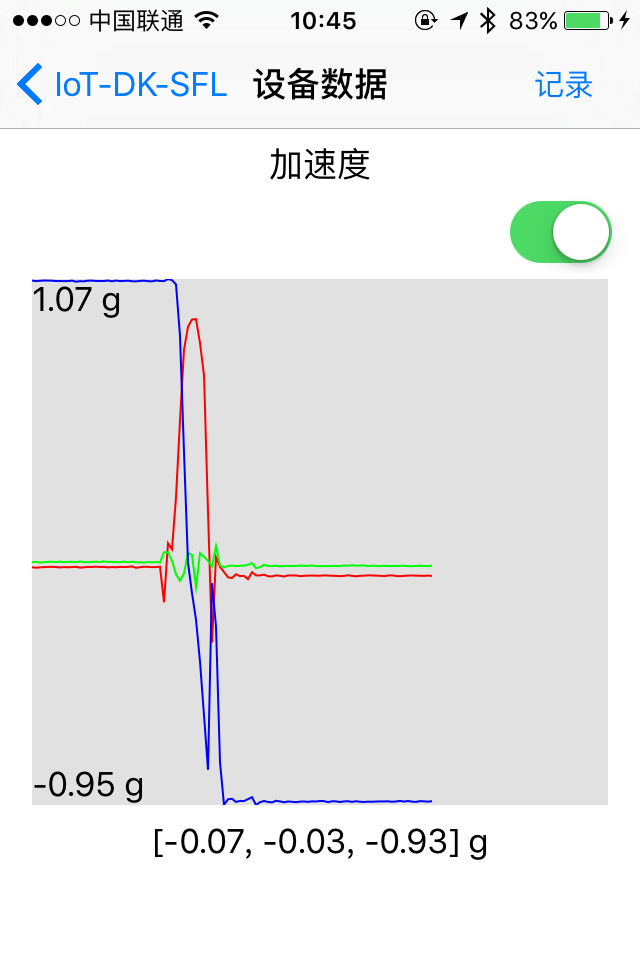
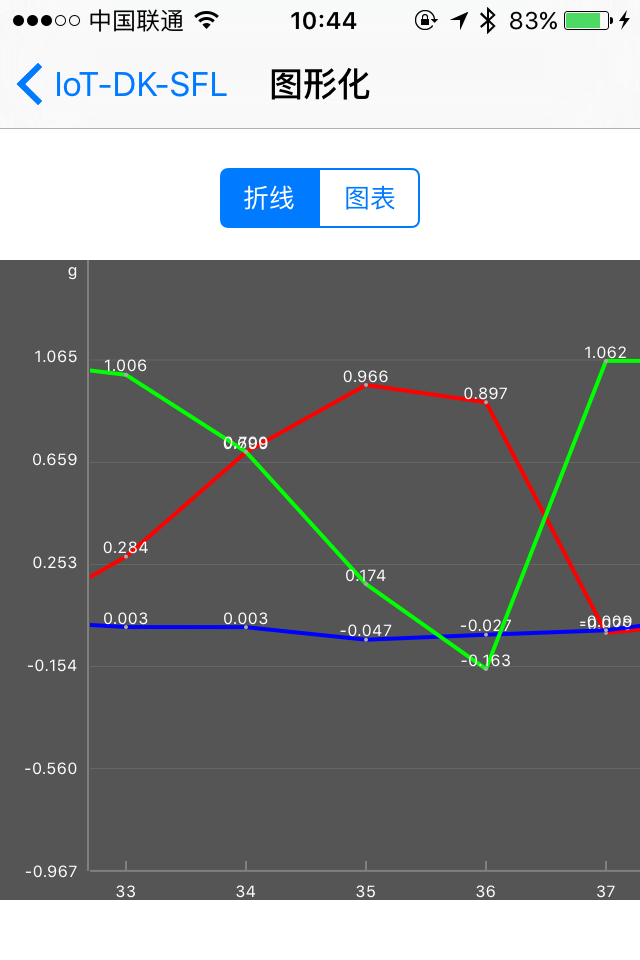

# 蓝牙传感器APP
## 产品简介
这是一款针对Dialog公司的蓝牙传感器样品设计的工具APP，使手机通过蓝牙连接到样品，接收加速度、陀螺仪等多种传感器的数据并显示在界面上。样品可以通过底层算法生成表示其当前旋转姿态的四元数，APP上据此动态展示样品的三维模型。
## APP界面
* 传感器列表  

* 三维模型  

* 实时数据  

* 历史数据图表  

## 更多信息
* [内测版下载地址](https://fir.im/snsr)