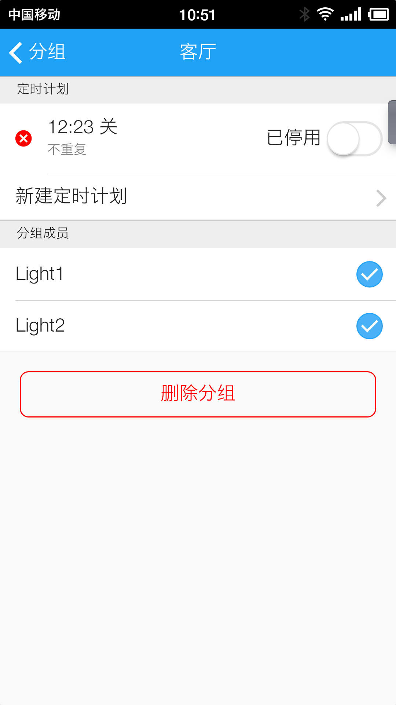

# “极简”智能照明系统
## 产品简介
客户的产品是采用Zigbee技术组网的无线照明开关，除了开关，客户还自行选择了MTK的RT5350无线路由器芯片搭建了网关的硬件平台。我司在此基础上，基于嵌入式Linux系统开发了网关软件，实现Zigbee网络的协议转换、数据本地存储和云端连接，并选择了云巴作为云端的IoT设备连接平台，BMOB作为数据管理平台，同时采用Cordova开发了适用于iOS和Android的手机APP，从而快速构建了从网关到云再到客户端的完整解决方案。
## 软件界面
* 设备

* 分组

* 定时计划

* 设置

## APP下载地址
[极简照明](https://fir.im/slit)