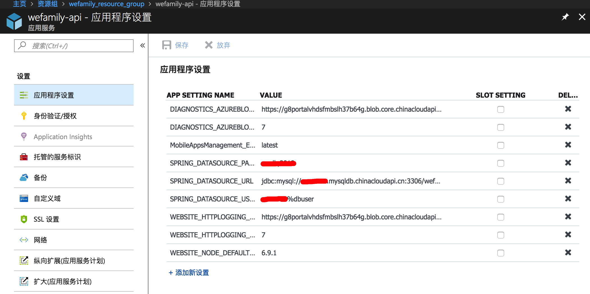
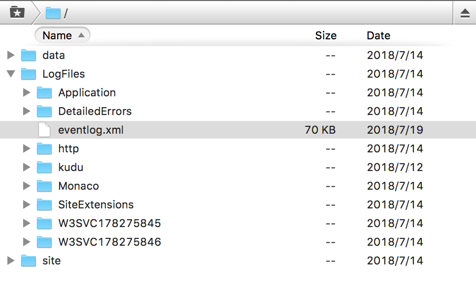
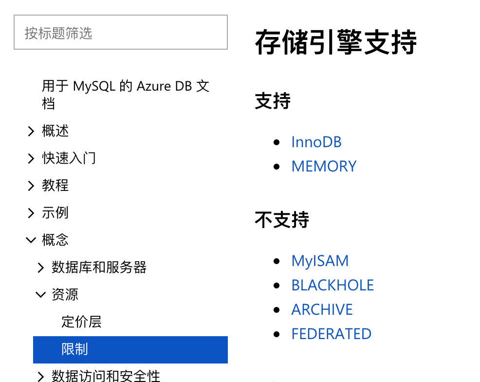

# 将Spring Boot应用连接到MySQL on Azure数据库
最近在Azure上以应用服务（App Service）的方式部署了一个Spring Boot应用，数据库选择了MySQL on Azure，这是一个PaaS级别的服务，其底层仍是虚拟机，但对应实例由Azure托管。本文记录部署过程，以及过程中遇到的问题和解决方法。  
## 部署过程
在开发环境中连接的是本机数据库，工作正常。数据库的配置写在applicaion.properties文件里：
```
spring.datasource.url=jdbc:mysql://localhost:3306/wefamily?user=dbuser&password=123456
spring.jpa.hibernate.ddl-auto=update
```
文件的第二行表示自动创建和更新数据库表。  
部署到Azure上以后，数据库连接参数改为通过环境变量指定。Spring Boot拥有强大的配置管理功能，环境变量的优先级要高于application.properties，会自动覆盖相关设置。  
设置环境变量有两种方法，一是使用Azure CLI，在命令行中执行：
```
az webapp config appsettings set --settings SPRING_DATASOURCE_URL="jdbc:mysql://dbinstance.mysql.database.azure.com:3306/wefamilydb" --resource-group wefamily_resource_group --name wefamily-api
az webapp config appsettings set --settings SPRING_DATASOURCE_USERNAME=dbinstance%dbuser --resource-group wefamily_resource_group --name wefamily-api
az webapp config appsettings set --settings SPRING_DATASOURCE_PASSWORD=123456 --resource-group wefamily_resource_group --name wefamily-api
```
二是使用portal，在应用服务的“应用程序设置”中手动添加和修改：  
  
配置好以后，应用无法正常访问，报500错误（The request timed out.）。
## 问题解决
通过FTP连接到部署目录，下载eventLog.xml查看：  
  
```
<Event>
    <System>
        <Provider Name="HttpPlatformHandler"/>
        <EventID>1000</EventID>
        <Level>1</Level>
        <Task>0</Task>
        <Keywords>Keywords</Keywords>
        <TimeCreated SystemTime="2018-07-14T10:04:05Z"/>
        <EventRecordID>35185953</EventRecordID>
        <Channel>Application</Channel>
        <Computer>RD0017FA007A37</Computer>
        <Security/>
    </System>
    <EventData>
        <Data>Process '5588' failed to start. Port = 21453, Error Code = '-2147023829'.</Data>
    </EventData>
</Event>
```
原因是应用的进程没能正常启动。  
尝试在本地连接Azure数据库，为了不修改代码，写了一个脚本：  
```
#!/bin/sh
export SPRING_DATASOURCE_URL="jdbc:mysql://dbinstance.mysqldb.chinacloudapi.cn:3306/wefamilydb"
export SPRING_DATASOURCE_USERNAME=dbinstance%dbuser
export SPRING_DATASOURCE_PASSWORD=123456
mvn spring-boot:run
```
发现应用同样不能启动，报错内容为：  
```
2018-07-19 11:28:14.546  WARN 1942 --- [           main] o.h.t.s.i.ExceptionHandlerLoggedImpl     : GenerationTarget encountered exception accepting command : Error executing DDL via JDBC Statement
org.hibernate.tool.schema.spi.CommandAcceptanceException: Error executing DDL via JDBC Statement
...
Caused by: java.sql.SQLException: Got error 1 from storage engine
        at com.mysql.jdbc.SQLError.createSQLException(SQLError.java:965) ~[mysql-connector-java-5.1.46.jar:5.1.46]
```
运行官方的[TodoList示例](https://github.com/azure-samples/mysql-spring-boot-todo)作对比，发现这个工程可以正常连接Azure上的数据库。
在网上搜索`Error executing DDL via JDBC Statement`错误，发现此问题多与数据库方言有关；同时结合`Got error 1 from storage engine`，判断问题可能与存储引擎有关。  
登录开发环境的MySQL，用`show table status from dbname`检查数据库表的存储引擎，发现自己的应用是MyISAM，而TodoList应用是InnoDB，再对比代码，两者最大的差别是Spring Boot版本不同，前者是2.0.3，后者是1.5.3。将TodoList应用的Spring Boot升级到2.0.3，在本地创建出来的数据库表果然变成了MyISAM引擎，同时也无法连接Azure上的数据库了。  
检查文档[Azure Database for MySQL 中的限制](https://docs.microsoft.com/zh-cn/azure/mysql/concepts-limits)，确认MySQL on Azure不支持MyISAM：  
  
在application.properties中添加配置，使用InnoDB引擎：  
```
spring.jpa.database-platform=org.hibernate.dialect.MySQL57InnoDBDialect
```
问题得以解决，应用可以在本地连接到Azure数据库，部署到云上以后也能正常访问了。
## 参考资料
* [Azure MySQL数据库_数据库托管服务 - Azure云计算](https://www.azure.cn/zh-cn/home/features/mysql/)
* [MySQL Database on Azure快速入门指南 | Azure Docs](https://docs.azure.cn/zh-cn/mysql/mysql-database-get-started#step1)
* [Announcing MySQL in-app for Web Apps (Windows) | Azure App Service Team Blog](https://blogs.msdn.microsoft.com/appserviceteam/2016/08/18/announcing-mysql-in-app-preview-for-web-apps/)
* [Build a Java and MySQL web app in Azure | Microsoft Docs](https://docs.microsoft.com/en-us/azure/app-service/app-service-web-tutorial-java-mysql)
* [【spring boot】spring boot 2.0 项目中使用mysql驱动启动创建的mysql数据表，引擎是MyISAM，如何修改启动时创建数据表引擎为InnoDB - Angel挤一挤 - 博客园](http://www.cnblogs.com/sxdcgaq8080/p/9035890.html)