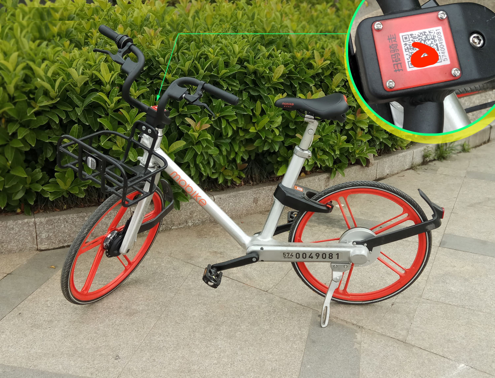
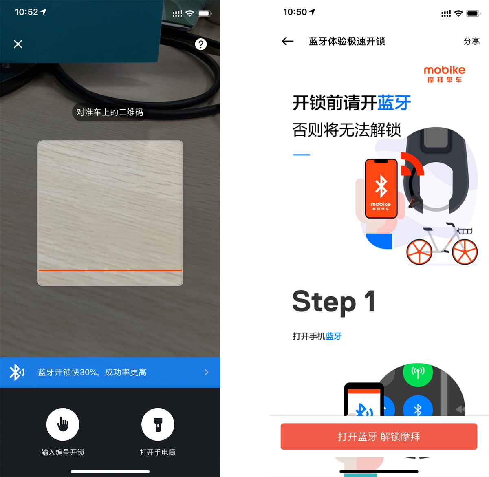
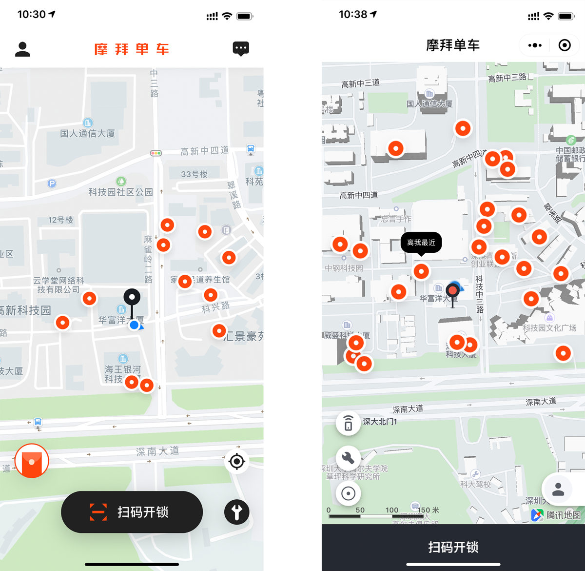

## Mini Program Workshop
Oct 21st, 2018

## Agenda
1. Talk
2. Demo
3. Hack

## **I**nternet **o**f **T**hings

  

## How mobike works
1. App: Scan QrCode on bike
1. App: Send bike id to server
1. Server: Send command to bike in SMS  
   or  
   App: Send command to bike with bluetooth

  

## Mini Program vs. Native App

  

  ### Advantages of Mini Program
  * For users: easy access, need no disk space
  * For developers: easy update, cross-platform

## Bluetooth Low Energy
1. Central and Peripheral
1. Service and Characteristics
1. Read, Write and Notify

  ### How to use BLE
  1. [Enable bluetooth](https://developers.weixin.qq.com/miniprogram/dev/api/device/bluetooth/wx.openBluetoothAdapter.html)
  1. [Scan nearby peripherals](https://developers.weixin.qq.com/miniprogram/dev/api/device/bluetooth/wx.startBluetoothDevicesDiscovery.html)
  1. [Establish a connection](https://developers.weixin.qq.com/miniprogram/dev/api/device/bluetooth/wx.createBLEConnection.html)
  1. Discover [services](https://developers.weixin.qq.com/miniprogram/dev/api/device/bluetooth/wx.getBLEDeviceServices.html) and [characteristics](https://developers.weixin.qq.com/miniprogram/dev/api/device/bluetooth/wx.getBLEDeviceCharacteristics.html)
  1. To send data: [Write characteristic value](https://developers.weixin.qq.com/miniprogram/dev/api/device/bluetooth/wx.writeBLECharacteristicValue.html)
  1. To receive data: [Enable](https://developers.weixin.qq.com/miniprogram/dev/api/device/bluetooth/wx.notifyBLECharacteristicValueChange.html) and [listen](https://developers.weixin.qq.com/miniprogram/dev/api/device/bluetooth/wx.onBLECharacteristicValueChange.html) for characteristic notifications
  1. (Optional) [Read characteristic value](https://developers.weixin.qq.com/miniprogram/dev/api/device/bluetooth/wx.readBLECharacteristicValue.html)

## Get started
[📖document](https://developers.weixin.qq.com/miniprogram/dev/index.html)
1. Register an account
  * need an e-mail address and a WeChat account
  * personal vs corporate
  * appid
2. Install the [🔗IDE](https://developers.weixin.qq.com/miniprogram/dev/devtools/download.html) - support Windows and Mac
3. Create a hello world project

  ## The Project Structure
  * App configs
  * Pages
    * wxml: Layout - what's on the screen
    * wxss: Style - how do they look like
    * js: Data - the contents and how do they changes

  ## The Sample Project
  [🔗Source code](https://developers.weixin.qq.com/miniprogram/dev/demo/demo.zip)  
  

## Demo
[🔗Prototype](https://www.processon.com/view/link/5bcbdd13e4b0fe81b6677215) [🔗Source Code](https://github.com/rabbitom/iot-mp)

## Bluetooth enabled gadgets
* [SensorTag(CC2650STK)](http://www.ti.com/ww/en/wireless_connectivity/sensortag/index.html), [buy on taobao](https://item.taobao.com/item.htm?spm=a230r.1.14.29.bb7251bckEWVMj&id=577128439180&ns=1&abbucket=19#detail)
* [micro:bit](https://www.microbit.org/) - [buy on taobao](https://detail.tmall.com/item.htm?spm=a230r.1.14.20.1f6e116eZtqpcM&id=555005031923&ns=1&abbucket=19)

## Hack SensorTag
* [CC2650 SensorTag User's Guide - Texas Instruments Wiki](http://processors.wiki.ti.com/index.php/CC2650_SensorTag_User's_Guide)
* in Chinese: [rabbitom/ble-sensors - GitHub](https://github.com/rabbitom/ble-sensors/blob/master/doc/TISensorTag-zh.md)

## Hack Micro:bit
* Animation Service  
  UUID: E95D7170-251D-470A-A062-FA1922DFA9A8
* Animation Type Charactersitic  
  UUID: E95DC306-251D-470A-A062-FA1922DFA9A8  
  Operations: Read, Write  
  Data: 1 = blink, 2 = wave, 3 = helical  
* Animation Status Control Charactersitic  
  UUID: E95DB84C-251D-470A-A062-FA1922DFA9A8  
  Operations: Write  
  Data: 1 = Start, 2 = Stop, 3 = Faster, 4 = Slower

## Contact
* Tom Hao
* GitHub: [rabbitom](http://github.com/rabbitom)
* E-mail: cooltools@qq.com
* Mobile/Wechat: 18818555615

## Meet me at TeamUp
