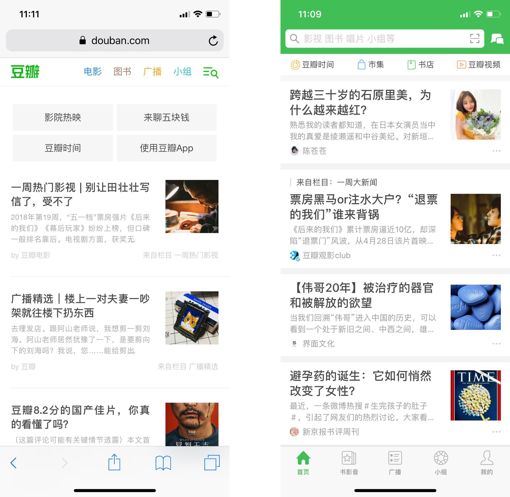
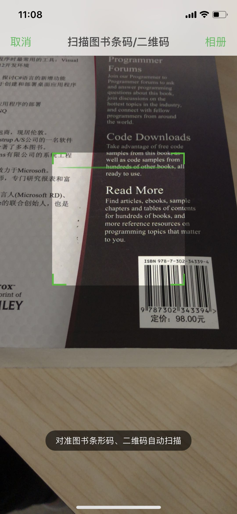
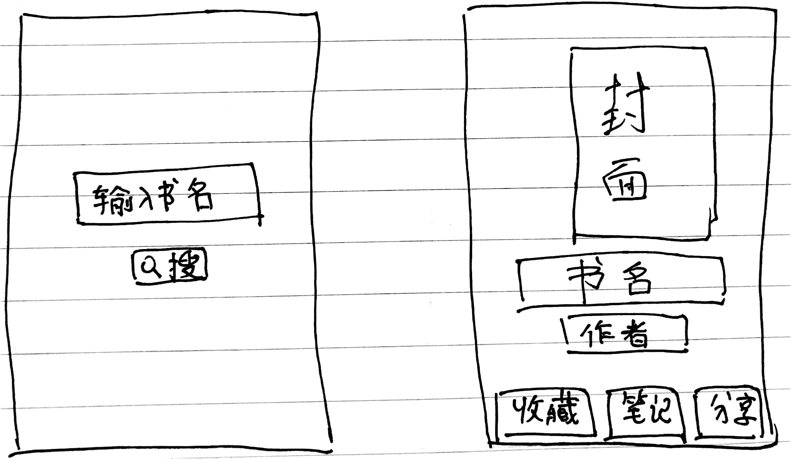

## Mini Program Workshop
May 5th, 2018

## What is Mini Program
kind of mobile app between **web** and **native**

  

  ### Has advantages of both
  * web: No need to install, no disk space needed, easy update, cross-platform
  * native: Run fast, access native functionality

  

  ### Not a new thing
  * 2007 iPhone only support web apps at very first [🔗](https://9to5mac.com/2011/10/21/jobs-original-vision-for-the-iphone-no-third-party-native-apps/)
  * Hybrid apps - app using web technology
  * 2015 Progressive web apps - modern browser features make web app-like [🔗](https://developers.google.cn/web/progressive-web-apps/)

  ### Plus the WeChat ecosystem
  * large user base, low-cost user acquisition
  * WeChat Pay, Group Chat, etc.

## Get started
[📖document](https://developers.weixin.qq.com/miniprogram/dev/index.html)
1. Register an account
  * need an e-mail address and a WeChat account
  * personal vs copoerate
  * appid
2. Install the IDE
  * support Windows and Mac
3. Create a hello world project

  ## The Project Structure
  * Pages
  * wxml: Layout - what's on the screen
  * wxss: Style - how do they look like
  * js: Data - the contents and how do they changes

  ## The Sample Project
  [🔗source code](https://developers.weixin.qq.com/miniprogram/dev/demo/demo.zip)  
  

## Example - A book shelf app
[💡the idea](http://note.youdao.com/noteshare?id=b1b07abdac3f51a212e858c93ec86390)
* Search for book by name
* Add to favorites
* Take notes
* Share

  

  ## The data
  * the search text
  * the book info
      * cover
      * title
      * author

  ## The backend
  * not necessary if data are generated and processed locally
  * a registred domain name, a cloud server, web api with **https** access
  * [douban api](https://developers.douban.com/wiki/?title=book_v2) with [a proxy](https://github.com/zce/douban-api-proxy)
    `https://douban.uieee.com/v2/book/search?q=`

## Expand the book shelf app
* show list of books
* scan barcode to search
* favorite list

### More ideas
(no backend needed)
* business card: put more about yourself on the hello world page
* body weight: record every day and show history in a chart
* book keeping: record income and  expend every day, show chart
* mark tv episode: mark the episode number you've watched
* credit card repay: record the deadlines to repay credit cards, sort in date

### More ideas
(need a backend as data source)
* events
  * show events in a calendar
  * share event list with friends
* outsourcing projects
  * show list of outsourcing projects
  * add to favorites
  * post a project

## Contact
* Tom Hao
* website: [http://teamup.ren](http://teamup.ren)
* e-mail: cooltools@qq.com
* mobile/wechat: 18818555615

## Meet me at TeamUp
