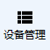

# 在WPF中创建和使用控件模板Control Template
WPF(Windows Presentation Foundation)是基于.Net Framework的Windows桌面应用开发框架，它使用XAML文件描述界面，比Windows Forms更加灵活。在WPF中，可以使用Control Template创建自定义控件，不仅能够随意定制控件样式，还可以方便地复用。本文以一个同时带有图标和文字的按钮为例，记录创建和使用Control Template的方法。  
我们使用的是矢量图标，首先到[Material Design Icons](https://materialdesignicons.com/)网站上找到所需图标，并复制XAML格式的代码（仅<Path>标签的内容），作为静态资源放到窗体的XAML文件中，并指定一个Key（理论上讲，也可以放到一个专门的ResourceDirectory文件中并在App.xaml里声明，作为全局资源引用，一开始也正是这样做的，但运行时图标显示不出来，原因不明）：
```
<Window.Resources>
    <Path x:Key="icon-view-list" Data="M9,5V9H21V5M9,19H21V15H9M9,14H21V10H9M4,9H8V5H4M4,19H8V15H4M4,14H8V10H4V14Z" Fill="Black" />
</Window.Resources>
```
接下来创建Button的布局：
```
<Button>
    <StackPanel Orientation="Vertical">
        <ContentControl Height="24" Width="24" Content="{StaticResource icon-view-list}" />
        <Label Padding="0">设备管理</Label>
    </StackPanel>
</Button>
```
运行后显示效果如图：  
  
我们的项目中需要多个这样的按钮，并且每个的图标和文字都不相同。接下来我们通过“文档大纲 - 编辑模板 - 编辑副本”尝试将这个布局提取成一个Control Template并引用它：
```
<Window.Resources>
    <Style x:Key="ButtonStyle1" TargetType="{x:Type Button}">
        <!--省略若干Setter-->
        <Setter Property="Template">
            <Setter.Value>
                <ControlTemplate TargetType="{x:Type Button}">
                    <Border x:Name="Bd" BorderBrush="{TemplateBinding BorderBrush}" BorderThickness="{TemplateBinding BorderThickness}" Background="{TemplateBinding Background}" Padding="{TemplateBinding Padding}" SnapsToDevicePixels="True">
                        <StackPanel Orientation="Vertical">
                            <ContentControl Height="24" Width="24" Content="{StaticResource icon-view-list}" />
                            <Label Padding="0" Content="{TemplateBinding Content}"/>
                        </StackPanel>
                    </Border>
                    <ControlTemplate.Triggers>
                        <!--省略若干Trigger-->
                    </ControlTemplate.Triggers>
                </ControlTemplate>
            </Setter.Value>
        </Setter>
    </Style>
</Window.Resources>

<Button Style="{DynamicResource ButtonStyle1}">设备管理</Button>
```
其中`<StackPanel>`部分是我们自己复制进模板的，替换掉自动生成的内容，并通过{TemplateBinding}将Button的文字绑定到模板里的Label当中，不过图标内容仍然是固定在模板里的，没有办法在引用时改变。为此，我们要在窗体对应的.xaml.cs文件中继承Button，创建一个新的类，增加图标属性：
```
public class IconButton : Button
{
    public static readonly DependencyProperty IconProperty = DependencyProperty.Register("Icon", typeof(object), typeof(IconButton));

    public object Icon
    {
        get { return GetValue(IconProperty) as object; }
        set { SetValue(IconProperty, value); }
    }
}
```
然后我们先重新生成一下项目，再修改xaml文件：
```
<Style x:Key="ButtonStyle1" TargetType="{x:Type local:IconButton}">
    <ControlTemplate TargetType="{x:Type local:IconButton}">
        <Border x:Name="Bd" BorderBrush="{TemplateBinding BorderBrush}" BorderThickness="{TemplateBinding BorderThickness}" Background="{TemplateBinding Background}" Padding="{TemplateBinding Padding}" SnapsToDevicePixels="True">
            <StackPanel Orientation="Vertical">
                <ContentControl Height="24" Width="24" Content="{TemplateBinding Icon}" />
                <Label Padding="0" Content="{TemplateBinding Content}"/>
            </StackPanel>
        </Border>
    
<local:IconButton Style="{DynamicResource ButtonStyle1}" Icon="{StaticResource icon-view-list}">设备管理</local:IconButton>
```
在资源部分，将Style的TargetType由Button改为local:IconButton，并在ControlTemplate中将Icon属性绑定到ContentControl；与之相对应，引用时的标签改为`<local:IconButton>`，并且增加Icon属性。  
如果在cs文件中为IconButton类增加一个静态方法：
```
public class IconButton : Button
{
    //此处略去了Icon属性定义
    static IconButton()
    {
        DefaultStyleKeyProperty.OverrideMetadata(typeof(IconButton), new FrameworkPropertyMetadata(typeof(IconButton)));
    }
}
```
那么`<Style>`就可以不指定Key，引用控件时也无需指定Style属性，相当于定义和使用了默认样式。  
我们也可以脱离窗体，定义全局的自定义控件：在项目上点击右键，选择“添加 - 新建项”，找到“自定义控件(WPF)”，输入文件名，点击添加，新建的类默认继承于Control，其样式定义在Themes/Generic.xaml文件中（通过这种方式创建的Control Template中不包含Triggers，需要自己定义状态切换时的样式改变）。