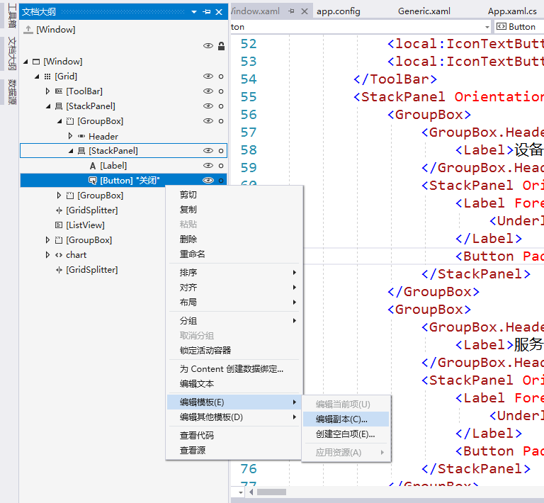

# 在WPF中创建和使用控件模板Control Template
WPF(Windows Presentation Foundation)是基于.Net Framework的Windows桌面应用开发框架，它使用XAML文件描述界面，比Windows Forms更加灵活。WPF支持通过Control Template自定义控件，不仅能够随意定制控件样式，还可以方便地复用。本文以一个同时带有图标和文字的按钮为例，记录创建和使用Control Template的方法。  
## 创建布局
我们使用的是矢量图标，首先到[Material Design Icons](https://materialdesignicons.com/)网站上找到所需图标，并复制XAML格式的代码（仅`<Path>`标签的内容），作为静态资源放到窗体的XAML文件中，并指定一个Key：
```
<Window.Resources>
    <Path x:Key="icon-view-list" Data="M9,5V9H21V5M9,19H21V15H9M9,14H21V10H9M4,9H8V5H4M4,19H8V15H4M4,14H8V10H4V14Z" Fill="Black" />
</Window.Resources>
```
理论上讲，`<Path>`也可以放到一个专门的ResourceDirectory文件中并在App.xaml里声明，作为全局资源引用，一开始也正是这样做的，但运行时图标显示不出来，原因不明。
接下来创建Button的布局：
```
<Button>
    <StackPanel Orientation="Vertical">
        <ContentControl Height="24" Width="24" Content="{StaticResource icon-view-list}" />
        <Label Padding="0">设备管理</Label>
    </StackPanel>
</Button>
```
运行后显示效果如图：  
  
## 生成模板
我们的项目中需要多个这样的按钮，并且每个的图标和文字都不相同。接下来我们通过“文档大纲 - 编辑模板 - 编辑副本”尝试将这个布局提取成一个Control Template并引用它：  

```
<Window.Resources>
    <Style x:Key="ButtonStyle1" TargetType="{x:Type Button}">
        <!--省略若干Setter-->
        <Setter Property="Template">
            <Setter.Value>
                <ControlTemplate TargetType="{x:Type Button}">
                    <Border x:Name="Bd" BorderBrush="{TemplateBinding BorderBrush}" BorderThickness="{TemplateBinding BorderThickness}" Background="{TemplateBinding Background}" Padding="{TemplateBinding Padding}" SnapsToDevicePixels="True">
                        <StackPanel Orientation="Vertical">
                            <ContentControl Height="24" Width="24" Content="{StaticResource icon-view-list}" />
                            <Label Padding="0" Content="{TemplateBinding Content}"/>
                        </StackPanel>
                    </Border>
                    <ControlTemplate.Triggers>
                        <!--省略若干Trigger-->
                    </ControlTemplate.Triggers>
                </ControlTemplate>
            </Setter.Value>
        </Setter>
    </Style>
</Window.Resources>

<Button Style="{DynamicResource ButtonStyle1}">设备管理</Button>
```
其中`<StackPanel>`部分是我们自己复制进模板的，替换掉自动生成的内容，并通过`{TemplateBinding Content}`将Button的文字绑定到模板中的Label。
## 添加属性
以上模板中，图标内容仍然是固定的，没有办法在引用时指定，为此，我们要在窗体对应的.xaml.cs文件中继承Button，创建一个新的类，增加图标属性：
```
public class IconButton : Button
{
    public static readonly DependencyProperty IconProperty = DependencyProperty.Register("Icon", typeof(object), typeof(IconButton));

    public object Icon
    {
        get { return GetValue(IconProperty) as object; }
        set { SetValue(IconProperty, value); }
    }
}
```
然后我们先重新生成一下项目，再修改xaml文件（不然VisualStudio会提示命名空间中不存在IconButton这个类）：
```
<Style x:Key="ButtonStyle1" TargetType="{x:Type local:IconButton}">
    <ControlTemplate TargetType="{x:Type local:IconButton}">
        <Border x:Name="Bd" BorderBrush="{TemplateBinding BorderBrush}" BorderThickness="{TemplateBinding BorderThickness}" Background="{TemplateBinding Background}" Padding="{TemplateBinding Padding}" SnapsToDevicePixels="True">
            <StackPanel Orientation="Vertical">
                <ContentControl Height="24" Width="24" Content="{TemplateBinding Icon}" />
                <Label Padding="0" Content="{TemplateBinding Content}"/>
            </StackPanel>
        </Border>
    
<local:IconButton Style="{DynamicResource ButtonStyle1}" Icon="{StaticResource icon-view-list}">设备管理</local:IconButton>
```
在资源部分，将Style的TargetType由Button改为local:IconButton，并在ControlTemplate中将Icon属性绑定到ContentControl；与之相对应，引用时的标签改为`<local:IconButton>`，并且增加Icon属性。  
## 从头创建模板
我们也可以脱离具体的窗体从头创建模板，并且这样创建的模板在项目的所有窗体中都可以使用。方法如下：在“解决方案资源管理器”的项目上点击右键，选择“添加 - 新建项”，找到“自定义控件(WPF)”，输入文件名，确认添加。Visual Studio将创建一个新的文件，其中包含与文件同名的类，继承于Control类，带有一个默认的静态构造函数：
```
public class IconButton : Control
{
    static IconButton()
    {
        DefaultStyleKeyProperty.OverrideMetadata(typeof(IconButton), new FrameworkPropertyMetadata(typeof(IconButton)));
    }
}
```
新建模板的样式定义在Themes/Generic.xaml文件中。与从现有布局中提取的模板不同，`<Style>`标签中不包含Key，引用控件时也无需指定Style名称，相当于定义和使用了默认样式。  
## 用户交互与样式变化
当用户将鼠标移动到控件上方、点击控件或控件不可用时，其样式都应当有所变化。  
上文通过已有布局生成的模板中包含了Triggers，通过控件状态属性的变化触发重新设置样式：
```
<ControlTemplate.Triggers>
    <Trigger Property="IsMouseOver" Value="True">
        <Setter Property="BorderBrush" TargetName="Bd" Value="#80DADADA"/>
        <Setter Property="Background" TargetName="Bd" Value="#210080FF"/>
    </Trigger>
    <Trigger Property="IsKeyboardFocused" Value="True">
        <Setter Property="BorderBrush" TargetName="Bd" Value="#80DADADA"/>
        <Setter Property="Background" TargetName="Bd" Value="#210080FF"/>
    </Trigger>
    <Trigger Property="IsPressed" Value="True">
        <Setter Property="BorderBrush" TargetName="Bd" Value="#90006CD9"/>
        <Setter Property="Background" TargetName="Bd" Value="#400080FF"/>
    </Trigger>
    <Trigger Property="IsEnabled" Value="False">
        <Setter Property="Foreground" Value="{DynamicResource {x:Static SystemColors.GrayTextBrushKey}}"/>
    </Trigger>
</ControlTemplate.Triggers>
```
其中`Bd`是模板中Border的名称：`<Border x:Name="Bd"`。  
除了Triggers，我们还可以通过VisualStateManager实现同样的功能。以下内容，放在模板的`<Border>`标签里：
```
<VisualStateManager.VisualStateGroups>
    <VisualStateGroup x:Name="CommonStates">
        <VisualState x:Name="Normal" />
        <VisualState x:Name="MouseOver">
            <Storyboard>
                <ColorAnimation Storyboard.TargetName="Bg" Storyboard.TargetProperty="Color" To="#CFE6FD" Duration="0" />
            </Storyboard>
        </VisualState>
        <VisualState x:Name="Pressed">
            <Storyboard>
                <ColorAnimation Storyboard.TargetName="Bg" Storyboard.TargetProperty="Color" To="#B2D8FE" Duration="0" />
                <ColorAnimation Storyboard.TargetName="Bd" Storyboard.TargetProperty="Color" To="#68A8E9" Duration="0" />
            </Storyboard>
        </VisualState>
    </VisualStateGroup>
</VisualStateManager.VisualStateGroups>
<Border.Background>
    <SolidColorBrush x:Name="Bg" Color="Transparent"/>
</Border.Background>
<Border.BorderBrush>
    <SolidColorBrush x:Name="Bd" Color="Transparent"/>
</Border.BorderBrush>
```
与Triggers中直接设置属性值不同，VisualStateManager中使用动画定义状态变化，并且可以指定动画的持续时间、速度等，实现更加生动的效果。

## 参考
* [Vector Icons in WPF](https://www.codeproject.com/tips/1089489/vector-icons-in-wpf) - 讲解如何在WPF中使用矢量图标
* [Customizing the Appearance of an Existing Control by Creating a ControlTemplate](https://docs.microsoft.com/en-us/dotnet/framework/wpf/controls/customizing-the-appearance-of-an-existing-control)
* [ControlTemplate Class](https://docs.microsoft.com/en-us/dotnet/api/system.windows.controls.controltemplate)