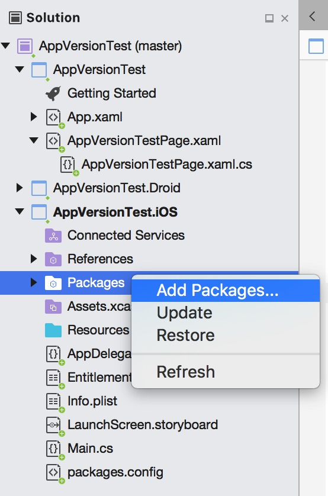

# 创建和使用Xamarin.Forms插件
Xamarin.Forms是一套跨平台移动开发框架，使用C#作为开发语言，100%兼容Android和iOS的原生API。对于API调用，一般通过依赖服务（DependencyService）在跨平台工程中声明接口，然后在各平台的工程中分别实现。对于可复用的API调用，可以考虑将其提取成一个插件，然后在其他项目中引用。  
本文以获取APP版本号为例，介绍创建和使用插件的基本方法。  

## 创建插件
1. 在Visual Studio for Mac中新建解决方案，选择Multiplatform Library模板：

    Implementation保持默认设置Platform Specific：
    向导会自动创建四个工程，除Android和iOS工程外还包括一个NuGet工程和一个Shared工程：
1. 在Shared工程中添加文件IAppVersion.cs定义一个接口：
    ```
    using System;
    namespace AppVersionPlugin
    {
        public interface IAppVersion
        {
            string VersionName { get; }
            string VersionCode { get; }
        }
    }
    ```
1. 在iOS工程添加AppVersion.cs实现接口：
    ```
    using System;
    using Foundation;

    namespace AppVersionPlugin
    {
        public class AppVersion : IAppVersion
        {
            public AppVersion()
            {
            }

            public string VersionName => NSBundle.MainBundle.InfoDictionary["CFBundleShortVersionString"].ToString();

            public string VersionCode => NSBundle.MainBundle.InfoDictionary["CFBundleVersion"].ToString();
        }
    }
    ```
1. 在Android工程中添加AppVersion.cs实现接口：
    ```
    using System;
    using Android.Content;

    namespace AppVersionPlugin
    {
        public class AppVersion : IAppVersion
        {
            static Context _context;

            public static void Init(Context context)
            {
                if (context != null)
                {
                    _context = context;
                }
            }

            public AppVersion()
            {
            }

            public string VersionName {
                get {
                    if (_context == null)
                        throw new Exception("AppVersion not inited");
                    else
                        return _context.PackageManager.GetPackageInfo(_context.PackageName, 0).VersionName;
                }
            }

            public string VersionCode {
                get
                {
                    if (_context == null)
                        throw new Exception("AppVersion not inited");
                    else
                        return _context.PackageManager.GetPackageInfo(_context.PackageName, 0).VersionCode.ToString();
                }
            }
        }
    }
    ```
    需要注意的是：如果是在Xamarin.Forms工程中，可以直接使用Forms.Context获取当前项目的Context，但设计插件时应当避免依赖Xamarin.Forms，确保其在非Forms工程中也能使用。因此这里添加了一个Init方法，用来在运行时由调用方传递Context。
1. 在NuGet工程中无需添加任何代码，只需完善一下元数据：
    然后在NuGet项目上点击右键，选择“Create NuGet Package”即可编译：
    生成的NuGet包在AppVersionPlugin.NuGet/bin/Debug或AppVersionPlugin.NuGet/bin/Release下，扩展名为.nupkg。

## 引用插件

1. 插件可以发布到NuGet的官方仓库，也可以自己托管在云存储上，但不是必需的，可以直接在本地引用：新建Xamarin.Forms项目，在Xamarin.iOS、Xamarin.Android和跨平台的PCL工程中，选择
Add Packages -> Configure Sources -> Add，定位到.nupkg文件所在的目录即可添加：
    
    
    
1. 在Xamarin.Android工程中添加初始化代码：
    ```
    using AppVersionPlugin;
    
    public class MainAcitivity
    {
        AppVersion.Init(this);
    }
    ```
1. 在跨平台工程中new一个AppVersion实例，即可获取相应的版本号：
    ```
    using AppVersionPlugin;
    ...
    AppVersion version = new AppVersion();
    versionLabel.Text = version.VersionName + " build " + version.VersionCode;
    ```

## TODO

* 将NuGet发布到官方源
* 将NuGet托管到云存储
* 测试和持续集成

## 参考
* [项目地址 - GitHub](https://github.com/rabbitom/XamarinAppVersionPlugin)
* [Creating New Platform-Specific Library Projects for NuGet](https://developer.xamarin.com/guides/cross-platform/application_fundamentals/nuget-multiplatform-libraries/platform-specific/) - 即本文创建NuGet包所使用的方式
* [Creating Reusable Plugins for Xamarin and Xamarin.Forms](https://blog.xamarin.com/creating-reusable-plugins-for-xamarin-forms/) - 2014年的文章，当时步骤还比较繁琐
* [Plugins - Easily add native functionality to Xamarin.Forms apps](https://developer.xamarin.com/guides/xamarin-forms/platform-features/plugins/) - Xamarin.Forms官方文档中对使用和创建插件的介绍
